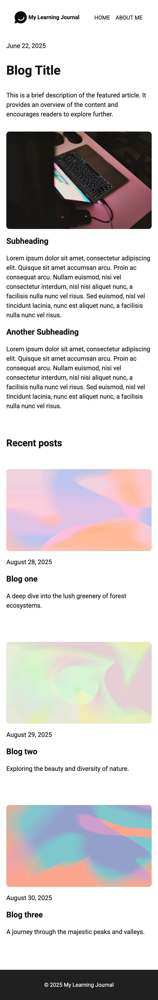

# Learning Journal

A responsive learning journal template,

## Tech Used

- HTML
- CSS
- JavaScript

## Features

- Mobile first approach

## Live Demo

[buzzpeep.netlify.app](https://buzzpeep.netlify.app/)

## Screenshots

## What I Learned

- Mobile first approach
- Fluid CSS units
- CSS Grid layouts
